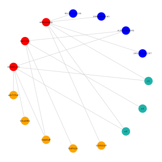

# MultipartiteGraphs.jl

Example of usage:

```julia
using LightGraphs, MetaGraphs, GraphPlot, MultipartiteGraphs

g = MultipartiteGraph()
```
## Add some vertices

```julia
users = ["u1", "u2", "u3"]
binaries = ["10301bf7", "f1ef763b", "0eed6aff", "04ce3f0b", "acb725a2"]
domains = ["domain.com", "learn.edu", "wikipedia.org"]
ips = ["93.172.226.55", "155.129.86.61", "4.204.201.145", "241.67.142.157"]

for u in users
    add_vertex!(g, "users", props=Dict(:name => u))
end
for b in binaries
    add_vertex!(g, "binaries", props=Dict(:name => b))
end
for d in domains
    add_vertex!(g, "domains", props=Dict(:name => d))
end
for i in ips
    add_vertex!(g, "ips", props=Dict(:name => i))
end
```

## ... and some edges

```julia
add_edge!(g, 1, 9, "user-domain")
add_edge!(g, 1, 11, "user-domain")
add_edge!(g, 2, 10, "user-domain")
add_edge!(g, 3, 9, "user-domain")
add_edge!(g, 3, 11, "user-domain")
add_edge!(g, 4, 11, "binary-domain")
add_edge!(g, 4, 11, "binary-domain")
add_edge!(g, 5, 10, "binary-domain")
add_edge!(g, 6, 10, "binary-domain")
add_edge!(g, 6, 9, "binary-domain")
add_edge!(g, 7, 9, "binary-domain")
add_edge!(g, 8, 9, "binary-domain")
add_edge!(g, 12, 11, "ip-domain")
add_edge!(g, 13, 11, "ip-domain")
add_edge!(g, 14, 9, "ip-domain")
add_edge!(g, 14, 10, "ip-domain")
add_edge!(g, 15, 11, "ip-domain")
```

```julia
nodelabel = [users; binaries; domains; ips]
nodecolor = ["lightseagreen", "orange", "red", "blue"]
nodefillc = nodecolor[[fill(1, length(users));
                       fill(2, length(binaries));
                       fill(3, length(domains));
                       fill(4, length(ips))]]
gplot(g, nodelabel=nodelabel, nodefillc=nodefillc, layout=circular_layout)
```



```julia
for v in vertices(g)
    println("$v: $(get_prop(g, v, :name))")
end

1: u1
2: u2
3: u3
4: 10301bf7
5: f1ef763b
6: 0eed6aff
7: 04ce3f0b
8: acb725a2
9: domain.com
10: learn.edu
11: wikipedia.org
12: 93.172.226.55
13: 155.129.86.61
14: 4.204.201.145
15: 241.67.142.157
```

## All Basic Lightgraphs and Metagraphs methods work

```julia
nv(g)
ne(g)
vertices(g)
edges(g)
has_vertex(g, 8)
has_edge(g, 3, 5)
all_neighbors(g, 6)
inneighbors(g, 9)
outneighbors(g, 9)
props(g, 3)
props(g, Edge(5, 10))
```

## Additional functionality

```julia
# number of vertices in a partite
mp_nv(g, "ips")

4
```

```julia
# number of edges in a relation
mp_ne(g, "user-domain")

5
```

```julia
# get all vertices of a partite
collect(mp_vertices(g, "binaries"))

5-element Array{Int64,1}:
 4
 5
 6
 7
 8
 ```
 
 ```julia
 # get all edges of a relation
collect(mp_edges(g, "binary-domain"))

6-element Array{LightGraphs.SimpleGraphs.SimpleEdge{Int64},1}:
 Edge 4 => 11
 Edge 5 => 10
 Edge 6 => 9 
 Edge 6 => 10
 Edge 7 => 9 
 Edge 8 => 9 
 ```
 
 ```julia
 # get all neighbors of a partite
mp_inneighbors(g, 14, partite="domains")

2-element Array{Int64,1}:
  9
 10
 ```
 
```julia
# get all neighbors from a relation
mp_inneighbors(g, 9, relation="ip-domain")

1-element Array{Int64,1}:
 14
```

```julia
# or use both possibilities
mp_inneighbors(g, 9, partite="ips", relation="user-domain")

0-element Array{Int64,1}
```
